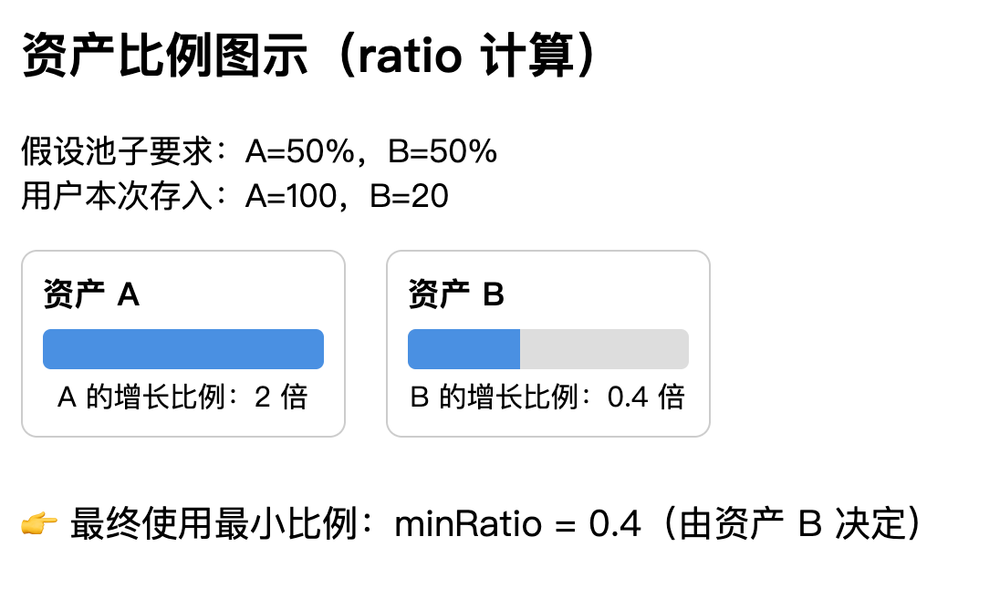

# mint 时份额的计算

和普通 LP 的计算一致

## 变量定义

- `reserves[i]` 池子中资产 i 的数量
- `amounts[i]` 用户本次实际增加的资产 i 数量
- `weights[i]` 资产 i 的权重
- `TOTAL_WEIGHT` 所有权重综合
- `ratio` 池子这次应该整体扩张的倍数

## 比例的计算公式

`uint256 ratio = amounts[i] * TOTAL_WEIGHT / (reserves[i] * weights[i])`

- 最终 `ratio = min(ratio)`

- 这个 ratio 表示本次存入的资产，按池子的要求，它们增长的比例
  

## 公式推导

### 第一步 每种资产单独看自己扩张的倍数

`ratio_i = amounts[i] / reserves[i]`

### 第二步 单独资产的倍数映射到池子的倍数 （引入权重）

资产 i 在整个池中的扩张份额是：  
`weight[i] / TOTAL_WEIGHT`

`ratio_i = ratio * 资产i在整个池子中的扩张份额`  
即 `ratio_i = ratio * (weight[i] / TOTAL_WEIGHT)`

由此可推出：

- `ratio = ratio_i * TOTAL_WEIGHT / weights[i]`

替换掉 ratio_i 得到

- `ratio = amounts[i]/reserves[i] * (TOTAL_WEIGHT / weights[i])`
- 注意，这里的 ratio 并不是扩大的倍数，而是`扩大的倍数 * TOTAL_WEIGHT`
- 因为没有做归一化处理，TOTAL_WEIGHT 不是 1，而是将整个值扩大了 TOTAL_WEIGHT 倍，这样的好处是没有小数
- 后续计算要 mint 多少 share 时要将 TOTAL_WEIGHT 除掉

### 计算 min(ratio) 就是本次的份额

## 注意，要将用户多转的资产返还

## 本次需要 mint 的数量

`shares  = totalSupply() * ratio / TOTAL_WEIGHT `

### 推导

- `mintShareAmount = 原有的share数 * 扩大的倍数 `
- `扩大的倍数 = minRatio / TOTAL_WEIGHT `
  - 因为正如前面所说的，计算 ratio 的时候为了避免小数点问题，没有做归一化处理，所以 TOTAL_WEIGHT 总权重不是 1，而是扩大了 TOTAL_WEIGHT 倍，所以再计算实际扩大倍数的时候，需要把 TOTAL_WEIGHT 除掉
- 带入可得： `mintShareAmount  = totalSupply() * minRatio / TOTAL_WEIGHT `
